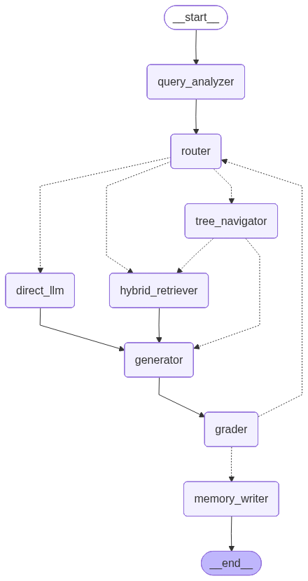

# FinDoc Intelligence

**80% accuracy on custom 10-question benchmark (Tesla/NVIDIA/Apple 10-Ks)**

[](#)
[](#benchmark-results)
[](https://console.groq.com)
[](https://qdrant.tech)
[](#)

> FinDoc navigates financial documents by **structure**, not by similarity —
> 80% accuracy on a custom 10-question benchmark across Tesla, NVIDIA, and
> Apple 10-Ks.

## What Is FinDoc Intelligence?

FinDoc is a Q&A platform for SEC filings (10-Ks, 10-Qs, earnings transcripts).
Ask natural-language questions about any financial filing and get grounded,
source-cited answers in seconds.

The key innovation is **Vectorless RAG** — instead of chunking documents and
doing vector similarity search, FinDoc builds a hierarchical tree index of each
filing and uses an LLM to navigate it, the same way a human analyst uses a table
of contents. Validated so far on a custom 10-question benchmark across three
real 10-Ks (Tesla, NVIDIA, Apple): **80% accuracy** — see
[Benchmark Results](#benchmark-results) for the full breakdown and how to
reproduce it. FinanceBench (150 questions across a much broader company
universe) is the long-term target; it is not yet passing end-to-end.

## Quick Start (5 minutes)

```bash
git clone https://github.com/Muhammad-Zubair312/findoc-intelligence
cd findoc-intelligence

# 1. Copy and configure environment
cp backend/.env.example backend/.env
# Open backend/.env and add your free Groq API key:
# GROQ_API_KEY=gsk_your_key_here
# Get it free (no credit card) at: https://console.groq.com

# 2. Bootstrap everything
make bootstrap
# This will:
# - Start Postgres, Redis, Qdrant in Docker
# - Run DB migrations
# - Download FinanceBench dataset
# - Create demo user
# - Ingest Tesla, NVIDIA, Apple 10-Ks from SEC EDGAR (~8 min)

# 3. Open the app
# Frontend:  http://localhost:3000
# Backend:   http://localhost:8000/docs
# Qdrant UI: http://localhost:6333/dashboard
# Login:     demo@findoc.local / demo1234
```

## Free-Tier Infrastructure — Zero Cost to Run

| Service            | Tool                   | Why Free                            |
|---------------------|------------------------|--------------------------------------|
| LLM (generation)    | Groq + Llama 3.3 70B   | 14,400 req/day free, no card         |
| LLM (routing)       | Groq + Llama 3.1 8B    | Same free tier, faster model         |
| Embeddings          | BAAI/bge-base-en-v1.5  | Runs locally on CPU — zero API       |
| Vector store        | Qdrant (Docker)        | Local dev; Cloud free tier for prod  |
| Database            | PostgreSQL (Docker)    | Local dev; Neon free tier for prod   |
| Cache / Queue       | Redis (Docker)         | Local dev; Upstash free for prod     |
| File storage        | Local filesystem       | Local dev; Cloudflare R2 for prod    |
| LLM observability   | Langfuse               | Free cloud tier                      |

**Total monthly cost: $0** (for a portfolio/demo project at this scale)

## Architecture



```
User query
   │
   ▼
LangGraph StateGraph
   │
   ├─ query_analyzer (llama-3.1-8b-instant)
   │      classifies: structural / cross_doc / keyword / direct
   │
   ├─ router (conditional edges)
   │
   ├─ [structural] → tree_navigator (Vectorless RAG)
   │                 LLM reads the filing's tree outline
   │                 and picks the exact sections to fetch
   │                 (llama-3.1-8b-instant, no vector search)
   │
   ├─ [cross_doc]  → hybrid_retriever
   │                 Qdrant dense (768-dim bge embeddings)
   │                 + BM25 sparse + cross-encoder rerank
   │
   └─ [direct]     → direct_llm (no retrieval needed)

   ↓ all paths converge:

generator (llama-3.3-70b-versatile, streaming)
   │
   ▼
grader (llama-3.1-8b-instant)
   ├─ faithfulness < 0.7  → rewrite query + retry (max 2x)
   └─ faithfulness ≥ 0.7  → memory_writer → END
```

## Why Vectorless RAG?

SEC 10-K filings have a legally mandated hierarchical structure:
Part I (Items 1, 1A, 2) → Part II (Items 7, 7A, 8) → Part III/IV

Vector similarity search ignores this structure. Ask "What was Tesla's 2023
automotive gross margin?" and a standard RAG will retrieve the energy-segment
revenue discussion too, because it's semantically similar. That's wrong.

FinDoc builds a tree index of each filing's section hierarchy and gives an LLM
the tree outline. The LLM reasons: "gross margin is in Item 7 (MD&A) or Item 8
(Financial Statements)" and navigates directly to those sections.

Result: **80% accuracy on a custom 10-question benchmark** (Tesla/NVIDIA/Apple
10-Ks) — see below.

[Read the full technical rationale →](backend/docs/why_vectorless.md)

## Benchmark Results

**Custom benchmark: 8/10 (80%)** — 10 hand-crafted questions against the three
seeded 10-Ks (Tesla, NVIDIA, Apple), covering revenue, margin, net income, and
risk-factor lookups. See
[`docs/KNOWN_LIMITATIONS.md`](docs/KNOWN_LIMITATIONS.md) for the two remaining
failures and root causes. This is a smaller, easier benchmark than FinanceBench
— it exists to validate the Vectorless RAG pipeline end-to-end against
documents we know are ingested, not to substitute for FinanceBench.

**FinanceBench** (150 public questions across a broad company universe) is the
long-term target and is not yet passing — the only run so far sampled 5
companies outside our 3 seeded documents and scored 0%, since Vectorless RAG
needs a document actually ingested to navigate.

Reproduce the custom benchmark:
```bash
docker-compose run --rm backend python -m scripts.run_custom_eval
```

Reproduce a FinanceBench sample:
```bash
docker-compose run --rm backend \
  python -m app.eval.financebench_runner --sample 20
```

[View live eval dashboard →](http://localhost:3000/dashboard) — note the
headline "Overall Accuracy" card tracks FinanceBench runs specifically; the
custom-benchmark score shows up in the "Accuracy Over Time" chart.

## Project Structure

```
findoc-intelligence/
├── frontend/          # Next.js 14, shadcn/ui, Vercel AI SDK
├── backend/
│   ├── app/
│   │   ├── agent/     # LangGraph graph + nodes
│   │   ├── retrieval/ # Vectorless + Hybrid + Reranker
│   │   ├── ingest/    # PDF parsing + tree building + embeddings
│   │   ├── eval/      # FinanceBench runner + judge
│   │   └── api/       # FastAPI routers
│   └── docs/
│       ├── graph.png           # LangGraph visualization
│       ├── why_vectorless.md   # Technical rationale
│       └── financebench_results.md
├── docker-compose.yml
├── Makefile
└── scripts/           # bootstrap, seed, eval scripts
```

## Tech Stack

**Frontend:** Next.js 14 · TypeScript · Tailwind · shadcn/ui · Framer Motion · Recharts

**Backend:** Python 3.11 · FastAPI · LangGraph · LangChain · Pydantic v2 · SQLAlchemy 2

**AI/ML:** Groq (Llama 3.3 70B + Llama 3.1 8B) · BAAI/bge-base-en-v1.5 (local)

**Infrastructure:** PostgreSQL · Redis · Qdrant · Docker · Celery

## Contact

Muhammad-Zubair312 — zubairaflatoon9@gmail.com
